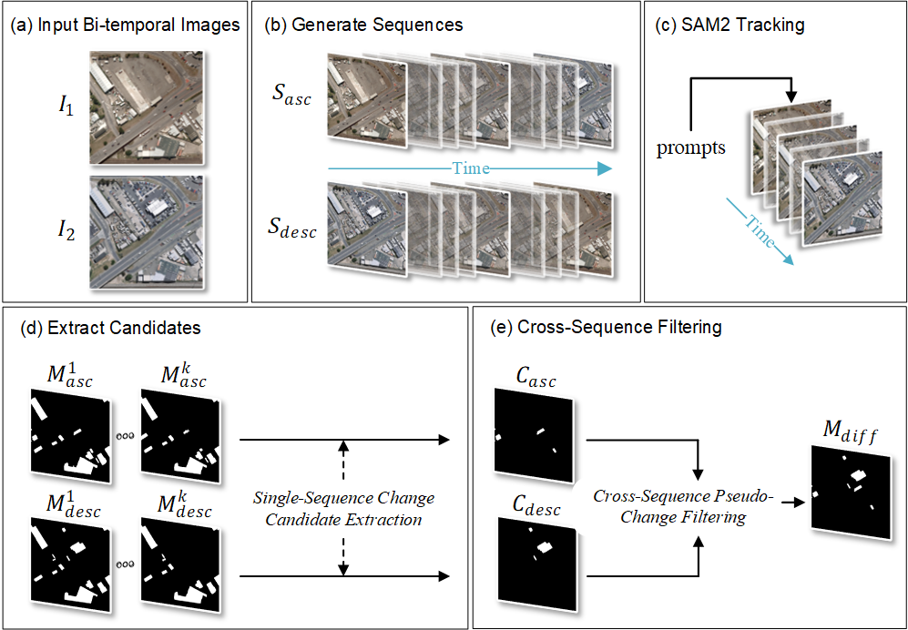

# BiSAM-CD: Zero-Shot Remote Sensing Change Detection via Bidirectional Temporal Memory in SAM2
[Yuan Qin](https://orcid.org/0009-0005-8953-9006)<sup>1,2</sup>, Jinyun Chen<sup>1,2</sup>, Chaoting Wang<sup>1,2</sup>,Chanling Pan<sup>1,2</sup>. <br />
<sup>1</sup> Guangxi Zhuang Autonomous Region Institute of Natural Resources Remote Sensing
<sup>2</sup> Key Laboratory of China-ASEAN Satellite Remote Sensing Applications, Ministry of Natural Resources

[[`Paper`](https://ieeexplore.ieee.org/abstract/document/11150452)]

Framework Overview of BiSAM-CD.(a) Input bi-temporal images *I<sub>1</sub>* and *I<sub>2</sub>*; (b) Bidirectional sequence generation (*S<sub>asc</sub>* and *S<sub>desc</sub>*) via adaptive interpolation; (c) SAM2-based object tracking initialized with prompts; (d) Change candidate extraction from single-sequence ID continuity checks; (e) Cross-sequence pseudo-change filtering through IoU validation, yielding final mask *M<sub>diff</sub>*.


## Environment Setup
First, create a virtual environment using conda:
```bash
conda create -n bisam-cd python=3.12 -y
conda activate bisam-cd
```
Then install the dependdencies of SAM2':
```bash
git clone https://github.com/facebookresearch/sam2.git && cd sam2

pip install -e .
```
To use the SAM 2 predictor and run the example notebooks, `jupyter` and `matplotlib` are required and can be installed by:

```bash
pip install -e ".[notebooks]"
```

Then install the dependdencies of BiSAM-CD:
```bash
cd .. && pip install -r requirements.txt
```

## Getting Started

### Download Checkpoints

First, we need to download a model checkpoint. All the model checkpoints can be downloaded by running:

```bash
cd checkpoints && \
./download_ckpts.sh && \
cd ..
```

or individually from:

- [sam2.1_hiera_tiny.pt](https://dl.fbaipublicfiles.com/segment_anything_2/092824/sam2.1_hiera_tiny.pt)
- [sam2.1_hiera_small.pt](https://dl.fbaipublicfiles.com/segment_anything_2/092824/sam2.1_hiera_small.pt)
- [sam2.1_hiera_base_plus.pt](https://dl.fbaipublicfiles.com/segment_anything_2/092824/sam2.1_hiera_base_plus.pt)
- [sam2.1_hiera_large.pt](https://dl.fbaipublicfiles.com/segment_anything_2/092824/sam2.1_hiera_large.pt)

### Image prediction

Run the example:

```bash
python example.py --ckpt_dir /Your SAM2 checkpoint directory/  --config_dir /SAM2 config directory/
```
`--config_dir` usually `/Your project/sam2/sam2/configs/sam2.1`, it is recommended to use an absolute path.

The example also includes prompts obtained from owlv2, which you can configure `--label_origin` to run:

```bash
python example.py --ckpt_dir /Your SAM2 checkpoint directory/  --config_dir /SAM2 config directory/ --label_origin whu_owlv2
```

## Acknowledgment
Our implementation is mainly based on following repositories. Thanks for their good works.
* [SAM2](https://github.com/facebookresearch/sam2)

## Citation
If you find our code helpful, please cite our paper:
```bibtex
@ARTICLE{qin2025bisam,
  author={Qin, Yuan and Chen, Jinyun and Wang, Chaoting and Pan, Chanling},
  journal={IEEE Transactions on Geoscience and Remote Sensing}, 
  title={BiSAM-CD: Zero-Shot Remote Sensing Change Detection via Bidirectional Temporal Memory in SAM2}, 
  year={2025},
  volume={63},
  number={},
  pages={1-12},
  keywords={Remote sensing;Training;Object tracking;Interpolation;Image segmentation;Adaptation models;Buildings;Annotations;Lighting;Computational modeling;Bidirectional temporal consistency;pseudo-change suppression;remote sensing change detection;segment anything model 2 (SAM2);training-free framework;zero-shot (ZS) learning},
  doi={10.1109/TGRS.2025.3605801}
}
```